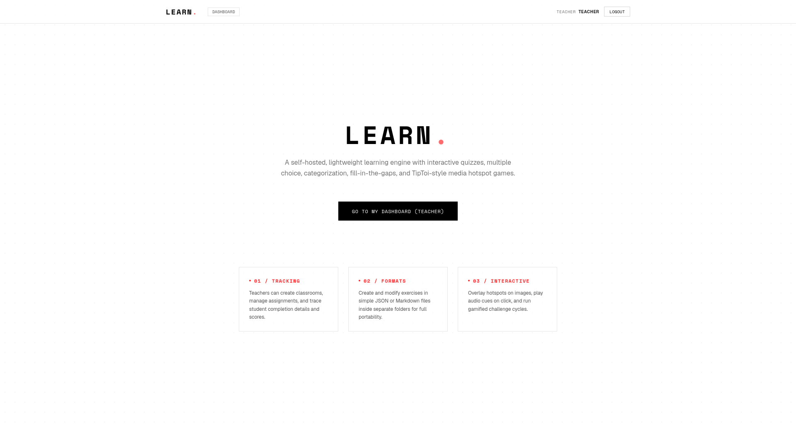
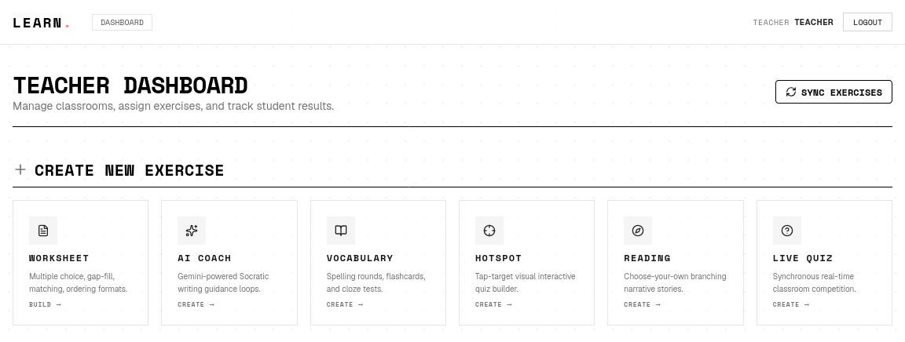

<div align="center">

# Learn

**Exercise & assignment platform for English classes**

_Built for the MORE! 1st-grade AHS/MS curriculum_

[](https://nextjs.org/)
[](https://react.dev/)
[](https://www.prisma.io/)
[](https://www.sqlite.org/)
[](https://tailwindcss.com/)
[](https://vitest.dev/)

</div>

---

## Overview

Learn is a self-hosted web application for creating, assigning, completing, and reviewing interactive language exercises. It supports 16 exercise types—ranging from multiple choice and gap-fills to image hotspot quizzes, interactive reading, oral vocabulary drills, and media-rich open questions—and handles the full workflow from content authoring to student submission, gradebook analytics, and manual teacher grading override.

Designed around the **MORE!** textbook series for Austrian English classes (Grades 1–4), but easily extensible to any language teaching context.

---

## Screenshots

<table>
  <tr>
    <td></td>
    <td></td>
  </tr>
  <tr>
    <td></td>
    <td></td>
  </tr>
  <tr>
    <td></td>
    <td></td>
  </tr>
</table>

## Core Features

### 👩‍🏫 For Teachers

- **Admin Panel** — Full administrator dashboard for managing users (create, edit, delete, activate/deactivate), classrooms, and auditing all Aloys AI conversations across the system. Admins can reset passwords, adjust usage quotas, view conversation transcripts, and manage exercise creator attribution.
- **Worksheet Creator** — Build mixed-modality exercises in a single worksheet (e.g. multiple-choice, gap-fill, drag-and-drop, categorization, matching, ordering, open questions, media embeds, instruction cards).
- **Pixabay Image Search Integration** — Search, preview, and download copyright-free public images directly into worksheets or vocabulary flashcards via a secure server proxy.
- **Text-to-Speech (TTS) Engine** — Automatically generate spoken pronunciation audio for vocabulary items (English & German) via an inline Python-based TTS pipeline. Integrated into the Vocabulary and Oral Vocabulary Quiz builders so audio prompts are created during exercise authoring.
- **Oral Vocabulary Quiz Creator** — Dedicated builder for audio-driven vocabulary tests where students hear a word and must type the correct translation. TTS audio is generated server-side at exercise build time.
- **Live Quiz Host** — Create and host Kahoot-like real-time synchronous quizzes supporting single choice, multiple choice, word ordering, and text inputs with live charts and a student leaderboard.
- **Aloys AI Socratic Tutor** — Monitor student conversations with Aloys, an AI tutor persona that guides learning through Socratic questioning rather than giving direct answers. View full transcripts of student chats, lesson completions, and quiz results.
- **Master Course Organizer** — Arrange exercises into units and courses with drag-and-drop reordering and assign them to classrooms in bulk.
- **Course-Centric Assignment Model** — Clean, course-oriented workflow that organizes worksheets into Courses, which are then assigned to Classrooms, ensuring sequential syllabus progression.
- **Course Insights Analytics Dashboard** — In-depth dashboard displaying class average scores, completion percentages, student spotlights (Top Achievers, Struggling, Inactive), toughest/easiest worksheets, and a comprehensive student progression grid.
- **Roster & Class Gradebook Matrix** — View a unified grid of student performance per assignment, drill down into student profiles to inspect attempts, and reset student passwords directly.
- **Worksheet & Course Exporters/Importers (ZIP)** — Package full worksheets (with assets) or courses (with structure and nested worksheets) into ZIP archives to transfer between instances, with automated conflict resolution for IDs.
- **Classroom Exporter/Importer (JSON)** — Export and import classroom rosters and student accounts using JSON.
- **Bulk Import/Export** — Add students in bulk using CSV/JSON formatted lists, and export the entire classroom gradebook to CSV for external school records.
- **Grading & Scoring Reviews** — Review student answers, view submission timelines, grade student open responses (media or free text), and overwrite automated scores.
- **Content Sync** — Synchronize exercises defined as JSON or Markdown on disk directly into the database. Handles soft-deletes smoothly.
- **Badges System** — Assign custom badge names and emojis to any exercise during creation or editing. Badges are displayed to students upon completion on their dashboard and in the teacher's student profile view, providing visual achievement milestones.
- **Multi-Page Worksheets** — Split worksheets into multiple pages with optional gate scoring (students must reach a minimum score to advance), enforcing sequential completion and mastery thresholds.
- **AI Socratic Hints** — Automatically generate Socratic guiding hints for any worksheet question via Gemini, helping students without giving answers.
- **Classroom AI Diagnostics** — Generate AI-powered diagnostic reports for any classroom, analyzing student performance and providing actionable teaching recommendations (fully supporting Gemini, OpenCode, and Ollama providers).
- **Ratings System** — Rate exercises 1–5 stars per teacher, with aggregated ratings visible in the teacher pool for quality curation.
- **Teacher Exercise Pool** — Browse, import, and use exercises shared across teachers, with ratings and metadata for discoverability.
- **Word of the Day** — Display a featured vocabulary word daily on student dashboards, configurable via exercise tags.


### 🧑‍🎓 For Students

- **Aloys AI Socratic Tutor** — Chat with Aloys, an AI-powered historical doctor and founder of the school who helps you learn through guided Socratic dialogue. Start free-form conversations or structured lessons with AI-generated reading texts and comprehension quizzes. Per-type sliding window usage quotas (30 chat inputs / 5 quiz generations per 45-minute window) plus a daily combined cap of 160, resetting automatically at 07:55.
- **PWA / Offline Support** — Installable as a Progressive Web App on mobile and desktop. The service worker caches core assets for offline access, and a dedicated offline page is shown when the network is unavailable. Supports notched mobile displays via `viewport-fit: cover`.
- **Interactive Player** — Responsive, dark-mode friendly workspace for solving drag-and-drop, clickable choice, categorization, and hotspot-based exercises.
- **Vocabulary Picture Supplementation** — Reinforce spelling retention with an experimental **Picture Match Stage** (Stage 4) grid quiz showing target words and distractors.
- **Live Quiz Gamepad** — Participate in real-time synchronous class games using a 6-digit PIN with speed-based scoring, live ranking feedback, and custom shape pads.
- **Oral Vocabulary Quiz** — Audio-driven vocabulary exercise where students hear a TTS-generated pronunciation and type the matching translation. Keyboard-friendly with autocorrect disabled during assessment.
- **Autocorrect Protection** — iPad-ready forms with autocorrect, suggestions, and spellcheck disabled by default to prevent unwanted keyboard assistance during assessments.
- **Rich Media Submissions** — Record audio directly in-browser via the `MediaRecorder` API or upload pictures as open-question submissions.
- **Attempt Multipliers** — Reward mastery by letting students retry exercises with decreasing score multipliers (100% &rarr; 75% &rarr; 50% &rarr; 25% max-score caps).
- **AI Feedback Quota** — Ask the coach for feedback up to 3 times per text attempt. This guides students through a Socratic revision process (first draft, second draft, and third draft review) before final submission.
- **Progress Dashboard** — View completed work, check outstanding assignments, and trace due dates.
- **Badges Showcase** — Earn custom badges for completed exercises (configured by teachers with custom name and emoji). Badges are displayed in a dedicated grid on the student dashboard, organized by exercise, with score achieved.
- **Multi-Page Worksheet Flow** — Navigate worksheets split across multiple pages with progress tracking and gate requirements (must pass each page before continuing).
- **Focus Mode (Binaural Beats / Rain Noise)** — Enable ambient focus sounds (binaural beats or rain noise) during assignments generated via the Web Audio API, with adjustable volume. Helps maintain concentration during assessments.
- **AI Mastery Memes** — Upon completing an assignment, receive a lighthearted AI-generated meme celebrating your achievement.
- **Socratic AI Hints** — Click the hint icon on any worksheet question to get an AI-generated guiding question without revealing the answer.
- **Vocabulary Multi-Stage Practice** — Progressive vocabulary practice moving through four stages: Multiple Choice → Hangman → Spelling → Mastered, with automatic advancement based on correct answers and AI-powered English definitions for each word.

---

## 🧱 Exercise & Widget Types

| Type | Interactive Widget Features | Grading Mechanism |
| :--- | :--- | :--- |
| **Multiple Choice** | Option lists with support for question media (audio/image) | Automated (correct option match) |
| **Gap Fill** | Text fields or inline dropdown lists inside sentences | Automated (exact match) |
| **Drag & Drop** | Drag items into corresponding placeholders in a sentence | Automated (exact position match) |
| **Categorization** | Drag-and-drop items into colored categorization bins | Automated (exact category match) |
| **Clickable Choice** | Toggle statement labels assigned to choices | Automated (exact state matches) |
| **Matching** | Match left-column cards to right-column items | Automated (correct key pairs) |
| **Open Question** | Text input with support for voice recording and image uploads | Advanced Rubric / Teacher Manual override |
| **Ordering** | Rearrange a randomized set of words into the correct sentence | Automated (exact order match) |
| **Media Embed** | Display images, play audio files, show embedded video, or embed YouTube videos via URL | Non-graded (Informational) |
| **Instruction Card**| Render formatted instructional text for worksheets | Non-graded (Informational) |
| **Image Hotspot Quiz**| Find and tap hidden regions/items on a background image | Automated (tap inside boundary box) |
| **Interactive Reading**| Branching "choose-your-own-adventure" story choices | Automated (completion path logic) |
| **Vocabulary Practice**| Multi-stage progressive practice: Multiple Choice → Hangman → Spelling → Mastered. Tiered mode (auto-advance through stages) or Oral Quiz mode (audio-driven). AI-powered English definitions on demand. | Automated (spelling or match checks via tiered stages) |
| **Oral Vocabulary Quiz** | Audio-based vocabulary quiz — pupils hear a TTS-generated pronunciation and type the translation | Automated (spelling match) |
| **Explore Image Map** | Interactive image map with audio hotspots and scene transitions | Non-graded (Exploratory) |
| **Live Quiz** | Synchronous multiplayer class game with single/multiple choice, text, and order inputs | Automated (speed-based scoring) |


### 📝 Advanced Open Question Evaluation

The `OpenQuestion` widget supports a rich evaluation rubric configured in the worksheet creator:
1. **Required Keywords**: Keywords that *must* appear in the response, with optional scoring weights (`keyword##weight`).
2. **Bonus Keywords**: Keywords that add extra score points if included (each bonus weight translates to `weight * 15` points, capped at 100%).
3. **Forbidden Keywords**: Trigger words that immediately void the score to 0% if detected.
4. **Spelling Tolerance**:
   - `strict`: Case-insensitive exact substring matching.
   - `lenient`: Match words with a Levenshtein distance of $\le 1$ to allow minor spelling mistakes.
   - `off`: Substring matching disabled (defaulting to manual grading).
5. **Media Override Flow**: If a student submits a response containing *only* audio or an image, automated keyword scoring is bypassed, and the server marks the submission as pending teacher review to avoid automatic fail grades.

---

## 🛡️ Security & Hardening Architecture

The application has been hardened to prevent tampering, unauthorized access, and resource abuse:

1. **Server-Authoritative Scoring**: The application never trusts client-computed scores. The server re-evaluates all answers against the disk configuration upon submission. Attempt multipliers are strictly tracked and applied on the server.
2. **Cryptographic Join Codes**: Classroom join codes are generated using cryptographically secure PRNGs (`crypto.randomBytes`) rather than predictable pseudorandom generators.
3. **Asset Serving Isolation**: API endpoints for exercises assets (`/api/exercises/[id]/assets/[...path]`) enforce active session checks, sanitize path parts to prevent directory traversal attacks (blocking `..` and relative slashes), and block configuration file reads (`index.json` or `index.md`).
4. **Upload Restrictions**: Submission and exercise uploads enforce strict extension allowlists (blocking SVG files to prevent XSS), limit maximum file sizes (20MB), and utilize secure UUIDs (`crypto.randomUUID`) to write unique target filenames.
5. **Brute-Force Rate Limiting**: The login endpoint `/api/auth/login` uses an in-memory rate-limiter keyed by IP and username, blocking authentication attempts for 5 minutes after 5 consecutive failures. The registration endpoint `/api/auth/register` is independently rate-limited by IP to block automated account creation, and usernames are normalized (lowercase + trim) before lookup to prevent enumeration.
6. **Transactional Integrity**: Critical database modifications—including bulk student roster imports, course assignment operations, and drag-and-drop course reorders—are fully wrapped in Prisma database transactions (`$transaction`) to guarantee atomic writes.
7. **Live Quiz Cryptographic PINs**: 6-digit Live Quiz join PINs are generated with `crypto.randomInt(100000, 1000000)` and strictly validated server-side (`/^\d{6}$/`, max nickname length 50).
8. **Live Quiz Host Authorization**: Every host action (`startLiveQuiz`, `endLiveQuestion`, `showLiveLeaderboard`, `nextLiveQuestion`, `finishLiveQuiz`) re-loads the session and rejects callers whose `userId` is not the recorded host.
9. **Live Quiz Participant Binding**: When a participant is linked to a user account, `submitLiveAnswer` verifies that the calling session's `userId` matches the participant's `userId` before accepting an answer, preventing one student from answering on behalf of another.
10. **Session Cookie Validation**: Decrypted session cookies are type-checked before use (`userId` and `username` must be strings, `role` must be `"TEACHER"` or `"STUDENT"`); malformed cookies are silently discarded instead of throwing.
11. **Upload Path-Traversal Protection**: `uploadMedia` resolves the absolute target path and rejects writes that escape the `assets/` directory, blocks filenames containing `..` or starting with `.`, and pre-checks the base64-decoded size to prevent OOM.
12. **AI Request Timeouts**: All Gemini API calls (writing-coach feedback, feedback goal improvement, cloze generation) use a 30-second `AbortController` so hung upstream requests cannot block server workers indefinitely.
13. **Rate-Limit Production Guard**: `resetRateLimitStoreForTests` short-circuits with a warning in `production` to prevent an accidental global reset of the brute-force limiter.
14. **Assignment Ownership**: `assignExercise` and `unassignAssignment` verify the target classroom belongs to the calling teacher before writing; an unauthorized caller receives an `Access denied` error rather than a mutation.

---

## 🛠️ Tech Stack

- **Framework**: Next.js 16 (App Router, Server Actions, Server Components)
- **UI & Layout**: React 19, Tailwind CSS 4, Lucide React icons
- **Database**: SQLite via Prisma 7
- **Authentication**: Encrypted session cookies (AES-256-GCM)
- **Validation**: Zod Schemas
- **Aloys AI Tutor**: OpenCode GO / Gemini / Ollama (configurable provider)
- **TTS Engine**: Python (kokoro-onnx) + Node.js child-process bridge (auto-downloads model files on first use)
- **Web Audio API**: Client-side binaural beats & rain noise focus mode
- **PWA**: Service Worker, Web App Manifest, offline fallback
- **Test Runner**: Vitest 3

---

## 📦 Project Structure

```
├── prisma/
│   ├── schema.prisma          # Database models (User, Classroom, Student, Assignment, etc.)
│   └── seed.ts                # Seeding script for development environments
├── content/
│   └── exercises/             # JSON/Markdown exercise definitions and media assets
├── public/
│   ├── sw.js                  # PWA Service Worker (offline caching)
│   ├── offline.html           # Offline fallback page
│   ├── apple-touch-icon.png   # Apple touch icon (180×180)
│   ├── icon-192.png           # PWA icon (192×192)
│   └── icon-512.png           # PWA icon (512×512)
├── src/
│   ├── app/
│   │   ├── actions.ts         # Delegating wrapper for server actions
│   │   ├── api/
│   │   │   ├── auth/          # Login, logout, register API endpoints
│   │   │   ├── exercises/     # Secure assets serving & teacher upload routes
│   │   │   └── submissions/   # Student media upload endpoint
│   │   ├── teacher/           # Teacher dashboard, creator client, classroom gradebook
│   │   ├── student/           # Student assignment player & dashboards
│   │   ├── manifest.ts        # PWA Web App Manifest
│   │   ├── layout.tsx         # Root container (PWA metadata, viewport, fonts)
│   ├── components/
│   │   ├── Navbar.tsx         # Unified global navigation
│   │   ├── PWARegistration.tsx # Service Worker registration component
│   │   └── widgets/           # 16 player widgets and builder helper scripts
│   └── lib/
│       ├── actions/           # Hardened server actions (classroom, course, exercise, submission)
│       ├── exercises.ts       # Zod exercise definitions, cache, and disk I/O helpers
│       ├── live-quiz-utils.ts # Pure Live Quiz helpers (answer evaluation, speed-based points)
│       ├── tts/               # Text-to-Speech engine (Python + TypeScript wrapper)
│       ├── rateLimit.ts       # Brute-force credentials rate-limiter
│       ├── session.ts         # Cookie encryption and session authorization utilities
│       ├── submissionScoring.ts # Server-side answers evaluation and grading logic
│       ├── actions/quota.ts   # Sliding-window AI usage quota enforcement (30 inputs / 5 quizzes per 45 min, 160/day at 07:55)
│       └── points.ts          # Core points calculation logic
└── vitest.config.ts           # Vitest unit test suite configuration
```

---

## 🚀 Getting Started

### Quick Install (Debian 13)

```bash
curl -fsSL https://cdn.jsdelivr.net/gh/damessner/learn_@main/install.sh | bash
```

### Proxmox LXC (one-command container)

```bash
bash -c "$(curl -fsSL https://cdn.jsdelivr.net/gh/damessner/learn_@main/learn-lxc.sh)"
```

This installs the platform to `/opt/learn` with:
- A **systemd service** (`learn.service`) running as the `learn` user, auto-restart on failure
- **Python TTS engine** (kokoro-onnx) for vocabulary pronunciation
- Optional **nginx reverse proxy** with Let's Encrypt SSL via Certbot

> **Default credentials after install:** `teacher` / `password` (Teacher), `student` / `password` (Student), `da.messner` / `Aloys2026!` (Admin), `weissenbach` / `Aloys2026!` (Admin). Classroom join code: `CLASS1`.

---

### Auto-Updates (via systemd timer)

The repo ships with two systemd unit files that automatically check for new git commits, pull, rebuild, and restart:

- [`systemd/learn-auto-update.service`](systemd/learn-auto-update.service) — the update logic
- [`systemd/learn-auto-update.timer`](systemd/learn-auto-update.timer) — fires every 15 minutes

The install script (`install.sh`) will prompt you to enable this during installation. To set it up manually on an existing install:

```bash
sudo cp systemd/learn-auto-update.* /etc/systemd/system/
sudo systemctl daemon-reload
sudo systemctl enable --now learn-auto-update.timer
```

The timer runs `git fetch`, compares HEAD to `origin/main`, and only pulls+rebuilds when there are actual new commits — so 99% of the polls are a lightweight no-op.

To manually trigger an update check:

```bash
sudo systemctl start learn-auto-update
```

---

### Manual Setup

#### Prerequisites

- Node.js 18+ (Node.js 24 LTS recommended)
- npm 9+

#### Installation

1. **Clone the repository**:
   ```bash
   git clone https://github.com/damessner/learn_.git
   cd learn_
   ```

2. **Install dependencies**:
   ```bash
   npm install
   ```

3. **Set up the Database**:

   For **development** (auto-sync schema without migration history):
   ```bash
   npx prisma db push
   npx prisma db seed
   ```

   For **production** (use migration files for controlled upgrades):
   ```bash
   npx prisma migrate deploy
   npx prisma db seed
   ```

4. **Configuration (`.env`)**:
   Create a `.env` file in the project root directory with these values. Edit it with any text editor:

   ```bash
   nano /opt/learn/.env              # production (install.sh path)
   nano .env                          # development (project root)
   sudo systemctl restart learn       # restart after editing in production
   ```

   Required and optional keys:

    ```env
    # Database (SQLite — relative to project root)
    DATABASE_URL="file:./dev.db"

    # Required: 32+ character hex string for session encryption
    # Generate with: openssl rand -hex 32
    SESSION_SECRET="your_32_character_session_secret_key"

    # Set to true only if you have HTTPS behind a reverse proxy.
    # Leave unset (or false) for plain HTTP.
    # SECURE_COOKIE="true"

    # --- Optional API Keys ---

    # Google Gemini — AI writing coach & Aloys fallback provider
    # Get a free key: https://aistudio.google.com/apikey
    GEMINI_API_KEY=""

    # Google Gemini model name (default: gemini-3.5-flash)
    # GEMINI_MODEL="gemini-3.5-flash"

    # Pixabay — image search inside the worksheet creator
    # Get a free key: https://pixabay.com/api/docs/
    PIXABAY_API_KEY="your_pixabay_api_key"

    # --- Aloys AI (Socratic Tutor) ---

    # AI provider: "opencode" (default), "gemini", or "ollama"
    ALOYS_AI_PROVIDER="opencode"

    # OpenCode GO (default provider)
    # Get a key at https://opencode.go
    OPENCODE_API_KEY=""
    OPENCODE_MODEL="deepseek-v4-flash"

    # Ollama (local alternative, no API key needed)
    OLLAMA_API_BASE="http://localhost:11434"
    OLLAMA_MODEL="gemma2"
    ```

5. **Start Development Server**:
   ```bash
   npm run dev
   ```
   Open [http://localhost:3000](http://localhost:3000) and register a teacher account.

---

## 🧪 Testing

The repository includes a comprehensive unit testing suite using Vitest that verifies rate limiting, join code generation, sliding-window AI quota enforcement, points multipliers, server-authoritative scoring, Live Quiz answer evaluation across all four question types, drag-drop answer normalization, and interactive-reading question-ID validation.

Run the test suite once (101 tests across 7 test files):
```bash
npm run test
```

Run tests in watch/interactive mode:
```bash
npm run test:watch
```

---

## 🔐 Rotating Secrets

All sensitive credentials live in `.env`. Rotate them without breaking existing sessions.

### `SESSION_SECRET`
Encrypts the session cookie (AES-256-GCM). Rotating this value invalidates **every** active session — every user (including admins) will be logged out. Do this if you suspect key compromise.

```bash
# Generate a fresh 32-byte hex key
openssl rand -hex 32

# Edit .env, replace SESSION_SECRET, then restart the app
sudo nano /opt/learn/.env
sudo systemctl restart learn
```

> **Tip:** Schedule rotations off-hours. Communicate the logout to users in advance.

### AI provider keys (`OPENCODE_API_KEY`, `GEMINI_API_KEY`, etc.)
Rotating an API key is non-disruptive for the server but **does** invalidate any in-flight requests. Rotate at the provider's portal first, then update `.env` and restart.

```bash
sudo nano /opt/learn/.env
sudo systemctl restart learn
```

### `PIXABAY_API_KEY`
Pixabay keys are tied to an account and have no in-flight state on our side. Just update `.env` and restart.

### `DATABASE_URL`
**Do not change casually.** A different path means a fresh empty database. If you need to migrate databases, use Prisma's standard migration workflow (`prisma migrate deploy`) on the new database first.

### What you do **not** need to rotate
- The bcrypt salt (handled per-user by `bcrypt.hash(password, 10)` inside `prisma/seed.ts` and admin user creation).
- TTS asset filenames on disk (regenerated on demand).
- Live-quiz PINs (single-session, regenerated each game).

---

## 📄 Configuration Formats

### Exercise JSON (`index.json`)

Exercises are validated via Zod schemas inside `src/lib/exercises.ts`. An example of a multi-page worksheet with a gate score and various question types:

```json
{
  "id": "u1-spelling-practice",
  "title": "Unit 1 Spelling Practice",
  "description": "Practice spelling and vocabulary words from Unit 1",
  "type": "worksheet",
  "tags": ["spelling", "unit-1"],
  "enforceGate": true,
  "gateRequiredScore": 60,
  "pages": [
    {
      "id": "p1",
      "title": "Multiple Choice",
      "questions": [
        {
          "id": "q1",
          "type": "multiple-choice",
          "question": "What is the spelling of 'apple'?",
          "options": ["aple", "apple", "applee"],
          "correctOptionIndex": 1,
          "ttsEnabled": true
        }
      ]
    },
    {
      "id": "p2",
      "title": "Open Questions",
      "questions": [
        {
          "id": "q2",
          "type": "open-question",
          "question": "Write a short sentence using the word 'spelling'.",
          "required": ["spelling##2.0"],
          "bonus": ["grammar##1.0", "sentence##1.0"],
          "forbidden": ["badword"],
          "spellingTolerance": "lenient",
          "allowAudio": true,
          "allowImage": true
        }
      ]
    }
  ]
}
```

Multi-page worksheets can be authored directly in JSON or built visually using the Worksheet Creator's page editor. Each page can optionally enforce a gate score (`enforceGate` / `gateRequiredScore`) requiring students to reach a minimum percentage before proceeding.

A vocabulary exercise with multi-stage practice modes:

```json
{
  "id": "u1-vocab-practice",
  "title": "Unit 1 Vocabulary",
  "description": "Vocabulary practice with tiered stages",
  "type": "vocabulary",
  "practiceMode": "tiered",
  "vocabList": [
    { "word": "apple", "translation": "der Apfel" },
    { "word": "book", "translation": "das Buch" }
  ]
}
```

The `practiceMode` field accepts `"tiered"` (auto-advance through MC → Hangman → Spelling → Mastered) or `"oral-quiz"` (audio-driven translation prompts).

## License

Private repository. All rights reserved.